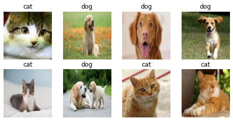
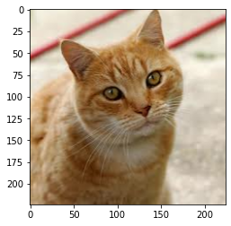
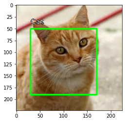

# Chitra


Image utility library for Deep Learning

## What is **CHITRA**

Chitra (चित्र) is an image utility library for Deep Learning tasks. *(It is not image-processing library.)*

Chitra reduces image data loading boilerplates for classification and object-detection.

It can also generate bounding-boxes from the annotated dataset.

**If you have more use cases please raise an issue with the feature you want.**

## Installation

### Using pip (recommended)
**`pip install -U chitra`**

### Manually
`git clone https://github.com/aniketmaurya/chitra.git`

`cd chitra`

`pip install -e .`

## How to use

<!-- Fill me in please! Don't forget code examples: -->
### Loading data for image classification

```python
import numpy as np
import tensorflow as tf
import chitra
from chitra.dataloader import Clf, show_batch
import matplotlib.pyplot as plt
```

```python
path = '/Users/aniket/Pictures/data/train'

clf_dl = Clf()
data = clf_dl.from_folder(path, target_shape=(224, 224))

clf_dl.show_batch(8, figsize=(8,8))
```

    CLASSES ENCODED: {'cat': 0, 'dog': 1}





```python
for e in data.take(1):
    image = e[0].numpy().astype('uint8')
    label = e[1].numpy()
plt.imshow(image)
```


    <matplotlib.image.AxesImage at 0x7fee1000df10>





### Visualization

#### Image annotation

Thanks to [fizyr](https://github.com/fizyr/keras-retinanet) keras-retinanet

```python
from chitra.visualization import draw_annotations
```

```python
labels = np.array([label])
bbox = np.array([[30, 50, 170, 190]])
label_to_name = lambda x: 'Cat' if x==0 else 'Dog'
```

```python
draw_annotations(image, ({'bboxes': bbox, 'labels':labels,}), label_to_name=label_to_name)
plt.imshow(image)
```


    <matplotlib.image.AxesImage at 0x7fee0fe37890>




