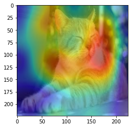

# chitra
> <p align="center">


## What is chitra?

**chitra** (**चित्र**) is an image utility library for Deep Learning tasks. *(It is not image-processing library)*

chitra reduces image data loading boilerplates for classification and object-detection.

It can also generate bounding-boxes from the annotated dataset.

If you have more use cases please [**raise an issue**](https://github.com/aniketmaurya/chitra/issues/new/choose) with the feature you want.

## Installation

### Using pip (recommended)

`pip install -U chitra`

### From source

```
git clone https://github.com/aniketmaurya/chitra.git
cd chitra
pip install -e .
```

## Usage

### Loading data for image classification


```python
import numpy as np
import tensorflow as tf
import chitra
from chitra.dataloader import Clf, show_batch
import matplotlib.pyplot as plt
```

```python
clf_dl = Clf()
data = clf_dl.from_folder(cat_dog_path, target_shape=(224, 224))

clf_dl.show_batch(8, figsize=(8,8))
```

    CLASSES ENCODED: {'cat': 0, 'dog': 1}


```python
for e in data.take(1):
    image = e[0].numpy().astype('uint8')
    label = e[1].numpy()
plt.imshow(image)
plt.show()
```


## Image datagenerator
Dataset class provides the flexibility to load image dataset by updating components of the class.

Components of Dataset class are:
- image file generator
- resizer
- label generator
- image loader

These components can be updated with custom function by the user according to their dataset structure. For example the Tiny Imagenet dataset is organized as-

```
train_folder/
.....folder1/
    .....file.txt
    .....folder2/
           .....image1.jpg
           .....image2.jpg
                     .
                     .
                     .
           ......imageN.jpg
                    
                      
```

The inbuilt file generator search for images on the `folder1`, now we can just update the `image file generator` and rest of the functionality will remain same.

**Dataset also support progressive resizing of images.**

### Updating component

```python
from chitra.datagenerator import Dataset
from glob import glob

ds = Dataset(data_path)
# it will load the folders and NOT images
ds.filenames[:3]
```

    No item present in the image size list


    ['/Users/aniket/Pictures/data/tiny-imagenet-200/train/n02795169/n02795169_boxes.txt',
     '/Users/aniket/Pictures/data/tiny-imagenet-200/train/n02795169/images',
     '/Users/aniket/Pictures/data/tiny-imagenet-200/train/n02769748/images']


```python
def load_files(path):
    return glob(f'{path}/*/images/*')

def get_label(path):
    return path.split('/')[-3]
    
ds.update_component('get_filenames', load_files)
ds.filenames[:3]
```

    get_filenames updated with <function load_files at 0x7fad6916d0e0>
    No item present in the image size list


    ['/Users/aniket/Pictures/data/tiny-imagenet-200/train/n02795169/images/n02795169_369.JPEG',
     '/Users/aniket/Pictures/data/tiny-imagenet-200/train/n02795169/images/n02795169_386.JPEG',
     '/Users/aniket/Pictures/data/tiny-imagenet-200/train/n02795169/images/n02795169_105.JPEG']


### Progressive resizing

```python
image_sz_list = [(28, 28), (32, 32), (64, 64)]

ds = Dataset(data_path, image_size=image_sz_list)
ds.update_component('get_filenames', load_files)
ds.update_component('get_label', get_label)


print()
# first call to generator
for img, label in ds.generator():
    print('first call to generator:', img.shape)
    break

# seconds call to generator
for img, label in ds.generator():
    print('seconds call to generator:', img.shape)
    break

# third call to generator
for img, label in ds.generator():
    print('third call to generator:', img.shape)
    break

```

    get_filenames updated with <function load_files at 0x7fad6916d0e0>
    get_label updated with <function get_label at 0x7fad6916d8c0>
    
    first call to generator: (28, 28, 3)
    seconds call to generator: (32, 32, 3)
    third call to generator: (64, 64, 3)


### tf.data support
Creating a `tf.data` dataloader was never as easy as this one liner. It converts the Python generator into `tf.data.Dataset` for a faster data loading, prefetching, caching and everything provided by tf.data.

```python
image_sz_list = [(28, 28), (32, 32), (64, 64)]

ds = Dataset(data_path, image_size=image_sz_list)
ds.update_component('get_filenames', load_files)
ds.update_component('get_label', get_label)

dl = ds.get_tf_dataset()

for e in dl.take(1):
    print(e[0].shape)

for e in dl.take(1):
    print(e[0].shape)

for e in dl.take(1):
    print(e[0].shape)
```

    get_filenames updated with <function load_files at 0x7fad6916d0e0>
    get_label updated with <function get_label at 0x7fad6916d8c0>
    (28, 28, 3)
    (32, 32, 3)
    (64, 64, 3)


## Learner
The Learner class inherits from `tf.keras.Model`, it contains everything that is required for training.

```python
from chitra.trainer import Trainer, create_cnn
from chitra.datagenerator import Dataset
from PIL import Image
```

```python
ds = Dataset(cat_dog_path, image_size=(224,224))
model = create_cnn('mobilenetv2', num_classes=2, name='Cat_Dog_Model')
trainer = Trainer(ds, model)
trainer.summary()
```

    WARNING:tensorflow:`input_shape` is undefined or non-square, or `rows` is not in [96, 128, 160, 192, 224]. Weights for input shape (224, 224) will be loaded as the default.
    Model: "Cat_Dog_Model"
    __________________________________________________________________________________________________
    Layer (type)                    Output Shape         Param #     Connected to                     
    ==================================================================================================
    input_1 (InputLayer)            [(None, None, None,  0                                            
    __________________________________________________________________________________________________
    Conv1_pad (ZeroPadding2D)       (None, None, None, 3 0           input_1[0][0]                    
    __________________________________________________________________________________________________
    Conv1 (Conv2D)                  (None, None, None, 3 864         Conv1_pad[0][0]                  
    __________________________________________________________________________________________________
    bn_Conv1 (BatchNormalization)   (None, None, None, 3 128         Conv1[0][0]                      
    __________________________________________________________________________________________________
    Conv1_relu (ReLU)               (None, None, None, 3 0           bn_Conv1[0][0]                   
    __________________________________________________________________________________________________
    expanded_conv_depthwise (Depthw (None, None, None, 3 288         Conv1_relu[0][0]                 
    __________________________________________________________________________________________________
    expanded_conv_depthwise_BN (Bat (None, None, None, 3 128         expanded_conv_depthwise[0][0]    
    __________________________________________________________________________________________________
    expanded_conv_depthwise_relu (R (None, None, None, 3 0           expanded_conv_depthwise_BN[0][0] 
    __________________________________________________________________________________________________
    expanded_conv_project (Conv2D)  (None, None, None, 1 512         expanded_conv_depthwise_relu[0][0
    __________________________________________________________________________________________________
    expanded_conv_project_BN (Batch (None, None, None, 1 64          expanded_conv_project[0][0]      
    __________________________________________________________________________________________________
    block_1_expand (Conv2D)         (None, None, None, 9 1536        expanded_conv_project_BN[0][0]   
    __________________________________________________________________________________________________
    block_1_expand_BN (BatchNormali (None, None, None, 9 384         block_1_expand[0][0]             
    __________________________________________________________________________________________________
    block_1_expand_relu (ReLU)      (None, None, None, 9 0           block_1_expand_BN[0][0]          
    __________________________________________________________________________________________________
    block_1_pad (ZeroPadding2D)     (None, None, None, 9 0           block_1_expand_relu[0][0]        
    __________________________________________________________________________________________________
    block_1_depthwise (DepthwiseCon (None, None, None, 9 864         block_1_pad[0][0]                
    __________________________________________________________________________________________________
    block_1_depthwise_BN (BatchNorm (None, None, None, 9 384         block_1_depthwise[0][0]          
    __________________________________________________________________________________________________
    block_1_depthwise_relu (ReLU)   (None, None, None, 9 0           block_1_depthwise_BN[0][0]       
    __________________________________________________________________________________________________
    block_1_project (Conv2D)        (None, None, None, 2 2304        block_1_depthwise_relu[0][0]     
    __________________________________________________________________________________________________
    block_1_project_BN (BatchNormal (None, None, None, 2 96          block_1_project[0][0]            
    __________________________________________________________________________________________________
    block_2_expand (Conv2D)         (None, None, None, 1 3456        block_1_project_BN[0][0]         
    __________________________________________________________________________________________________
    block_2_expand_BN (BatchNormali (None, None, None, 1 576         block_2_expand[0][0]             
    __________________________________________________________________________________________________
    block_2_expand_relu (ReLU)      (None, None, None, 1 0           block_2_expand_BN[0][0]          
    __________________________________________________________________________________________________
    block_2_depthwise (DepthwiseCon (None, None, None, 1 1296        block_2_expand_relu[0][0]        
    __________________________________________________________________________________________________
    block_2_depthwise_BN (BatchNorm (None, None, None, 1 576         block_2_depthwise[0][0]          
    __________________________________________________________________________________________________
    block_2_depthwise_relu (ReLU)   (None, None, None, 1 0           block_2_depthwise_BN[0][0]       
    __________________________________________________________________________________________________
    block_2_project (Conv2D)        (None, None, None, 2 3456        block_2_depthwise_relu[0][0]     
    __________________________________________________________________________________________________
    block_2_project_BN (BatchNormal (None, None, None, 2 96          block_2_project[0][0]            
    __________________________________________________________________________________________________
    block_2_add (Add)               (None, None, None, 2 0           block_1_project_BN[0][0]         
                                                                     block_2_project_BN[0][0]         
    __________________________________________________________________________________________________
    block_3_expand (Conv2D)         (None, None, None, 1 3456        block_2_add[0][0]                
    __________________________________________________________________________________________________
    block_3_expand_BN (BatchNormali (None, None, None, 1 576         block_3_expand[0][0]             
    __________________________________________________________________________________________________
    block_3_expand_relu (ReLU)      (None, None, None, 1 0           block_3_expand_BN[0][0]          
    __________________________________________________________________________________________________
    block_3_pad (ZeroPadding2D)     (None, None, None, 1 0           block_3_expand_relu[0][0]        
    __________________________________________________________________________________________________
    block_3_depthwise (DepthwiseCon (None, None, None, 1 1296        block_3_pad[0][0]                
    __________________________________________________________________________________________________
    block_3_depthwise_BN (BatchNorm (None, None, None, 1 576         block_3_depthwise[0][0]          
    __________________________________________________________________________________________________
    block_3_depthwise_relu (ReLU)   (None, None, None, 1 0           block_3_depthwise_BN[0][0]       
    __________________________________________________________________________________________________
    block_3_project (Conv2D)        (None, None, None, 3 4608        block_3_depthwise_relu[0][0]     
    __________________________________________________________________________________________________
    block_3_project_BN (BatchNormal (None, None, None, 3 128         block_3_project[0][0]            
    __________________________________________________________________________________________________
    block_4_expand (Conv2D)         (None, None, None, 1 6144        block_3_project_BN[0][0]         
    __________________________________________________________________________________________________
    block_4_expand_BN (BatchNormali (None, None, None, 1 768         block_4_expand[0][0]             
    __________________________________________________________________________________________________
    block_4_expand_relu (ReLU)      (None, None, None, 1 0           block_4_expand_BN[0][0]          
    __________________________________________________________________________________________________
    block_4_depthwise (DepthwiseCon (None, None, None, 1 1728        block_4_expand_relu[0][0]        
    __________________________________________________________________________________________________
    block_4_depthwise_BN (BatchNorm (None, None, None, 1 768         block_4_depthwise[0][0]          
    __________________________________________________________________________________________________
    block_4_depthwise_relu (ReLU)   (None, None, None, 1 0           block_4_depthwise_BN[0][0]       
    __________________________________________________________________________________________________
    block_4_project (Conv2D)        (None, None, None, 3 6144        block_4_depthwise_relu[0][0]     
    __________________________________________________________________________________________________
    block_4_project_BN (BatchNormal (None, None, None, 3 128         block_4_project[0][0]            
    __________________________________________________________________________________________________
    block_4_add (Add)               (None, None, None, 3 0           block_3_project_BN[0][0]         
                                                                     block_4_project_BN[0][0]         
    __________________________________________________________________________________________________
    block_5_expand (Conv2D)         (None, None, None, 1 6144        block_4_add[0][0]                
    __________________________________________________________________________________________________
    block_5_expand_BN (BatchNormali (None, None, None, 1 768         block_5_expand[0][0]             
    __________________________________________________________________________________________________
    block_5_expand_relu (ReLU)      (None, None, None, 1 0           block_5_expand_BN[0][0]          
    __________________________________________________________________________________________________
    block_5_depthwise (DepthwiseCon (None, None, None, 1 1728        block_5_expand_relu[0][0]        
    __________________________________________________________________________________________________
    block_5_depthwise_BN (BatchNorm (None, None, None, 1 768         block_5_depthwise[0][0]          
    __________________________________________________________________________________________________
    block_5_depthwise_relu (ReLU)   (None, None, None, 1 0           block_5_depthwise_BN[0][0]       
    __________________________________________________________________________________________________
    block_5_project (Conv2D)        (None, None, None, 3 6144        block_5_depthwise_relu[0][0]     
    __________________________________________________________________________________________________
    block_5_project_BN (BatchNormal (None, None, None, 3 128         block_5_project[0][0]            
    __________________________________________________________________________________________________
    block_5_add (Add)               (None, None, None, 3 0           block_4_add[0][0]                
                                                                     block_5_project_BN[0][0]         
    __________________________________________________________________________________________________
    block_6_expand (Conv2D)         (None, None, None, 1 6144        block_5_add[0][0]                
    __________________________________________________________________________________________________
    block_6_expand_BN (BatchNormali (None, None, None, 1 768         block_6_expand[0][0]             
    __________________________________________________________________________________________________
    block_6_expand_relu (ReLU)      (None, None, None, 1 0           block_6_expand_BN[0][0]          
    __________________________________________________________________________________________________
    block_6_pad (ZeroPadding2D)     (None, None, None, 1 0           block_6_expand_relu[0][0]        
    __________________________________________________________________________________________________
    block_6_depthwise (DepthwiseCon (None, None, None, 1 1728        block_6_pad[0][0]                
    __________________________________________________________________________________________________
    block_6_depthwise_BN (BatchNorm (None, None, None, 1 768         block_6_depthwise[0][0]          
    __________________________________________________________________________________________________
    block_6_depthwise_relu (ReLU)   (None, None, None, 1 0           block_6_depthwise_BN[0][0]       
    __________________________________________________________________________________________________
    block_6_project (Conv2D)        (None, None, None, 6 12288       block_6_depthwise_relu[0][0]     
    __________________________________________________________________________________________________
    block_6_project_BN (BatchNormal (None, None, None, 6 256         block_6_project[0][0]            
    __________________________________________________________________________________________________
    block_7_expand (Conv2D)         (None, None, None, 3 24576       block_6_project_BN[0][0]         
    __________________________________________________________________________________________________
    block_7_expand_BN (BatchNormali (None, None, None, 3 1536        block_7_expand[0][0]             
    __________________________________________________________________________________________________
    block_7_expand_relu (ReLU)      (None, None, None, 3 0           block_7_expand_BN[0][0]          
    __________________________________________________________________________________________________
    block_7_depthwise (DepthwiseCon (None, None, None, 3 3456        block_7_expand_relu[0][0]        
    __________________________________________________________________________________________________
    block_7_depthwise_BN (BatchNorm (None, None, None, 3 1536        block_7_depthwise[0][0]          
    __________________________________________________________________________________________________
    block_7_depthwise_relu (ReLU)   (None, None, None, 3 0           block_7_depthwise_BN[0][0]       
    __________________________________________________________________________________________________
    block_7_project (Conv2D)        (None, None, None, 6 24576       block_7_depthwise_relu[0][0]     
    __________________________________________________________________________________________________
    block_7_project_BN (BatchNormal (None, None, None, 6 256         block_7_project[0][0]            
    __________________________________________________________________________________________________
    block_7_add (Add)               (None, None, None, 6 0           block_6_project_BN[0][0]         
                                                                     block_7_project_BN[0][0]         
    __________________________________________________________________________________________________
    block_8_expand (Conv2D)         (None, None, None, 3 24576       block_7_add[0][0]                
    __________________________________________________________________________________________________
    block_8_expand_BN (BatchNormali (None, None, None, 3 1536        block_8_expand[0][0]             
    __________________________________________________________________________________________________
    block_8_expand_relu (ReLU)      (None, None, None, 3 0           block_8_expand_BN[0][0]          
    __________________________________________________________________________________________________
    block_8_depthwise (DepthwiseCon (None, None, None, 3 3456        block_8_expand_relu[0][0]        
    __________________________________________________________________________________________________
    block_8_depthwise_BN (BatchNorm (None, None, None, 3 1536        block_8_depthwise[0][0]          
    __________________________________________________________________________________________________
    block_8_depthwise_relu (ReLU)   (None, None, None, 3 0           block_8_depthwise_BN[0][0]       
    __________________________________________________________________________________________________
    block_8_project (Conv2D)        (None, None, None, 6 24576       block_8_depthwise_relu[0][0]     
    __________________________________________________________________________________________________
    block_8_project_BN (BatchNormal (None, None, None, 6 256         block_8_project[0][0]            
    __________________________________________________________________________________________________
    block_8_add (Add)               (None, None, None, 6 0           block_7_add[0][0]                
                                                                     block_8_project_BN[0][0]         
    __________________________________________________________________________________________________
    block_9_expand (Conv2D)         (None, None, None, 3 24576       block_8_add[0][0]                
    __________________________________________________________________________________________________
    block_9_expand_BN (BatchNormali (None, None, None, 3 1536        block_9_expand[0][0]             
    __________________________________________________________________________________________________
    block_9_expand_relu (ReLU)      (None, None, None, 3 0           block_9_expand_BN[0][0]          
    __________________________________________________________________________________________________
    block_9_depthwise (DepthwiseCon (None, None, None, 3 3456        block_9_expand_relu[0][0]        
    __________________________________________________________________________________________________
    block_9_depthwise_BN (BatchNorm (None, None, None, 3 1536        block_9_depthwise[0][0]          
    __________________________________________________________________________________________________
    block_9_depthwise_relu (ReLU)   (None, None, None, 3 0           block_9_depthwise_BN[0][0]       
    __________________________________________________________________________________________________
    block_9_project (Conv2D)        (None, None, None, 6 24576       block_9_depthwise_relu[0][0]     
    __________________________________________________________________________________________________
    block_9_project_BN (BatchNormal (None, None, None, 6 256         block_9_project[0][0]            
    __________________________________________________________________________________________________
    block_9_add (Add)               (None, None, None, 6 0           block_8_add[0][0]                
                                                                     block_9_project_BN[0][0]         
    __________________________________________________________________________________________________
    block_10_expand (Conv2D)        (None, None, None, 3 24576       block_9_add[0][0]                
    __________________________________________________________________________________________________
    block_10_expand_BN (BatchNormal (None, None, None, 3 1536        block_10_expand[0][0]            
    __________________________________________________________________________________________________
    block_10_expand_relu (ReLU)     (None, None, None, 3 0           block_10_expand_BN[0][0]         
    __________________________________________________________________________________________________
    block_10_depthwise (DepthwiseCo (None, None, None, 3 3456        block_10_expand_relu[0][0]       
    __________________________________________________________________________________________________
    block_10_depthwise_BN (BatchNor (None, None, None, 3 1536        block_10_depthwise[0][0]         
    __________________________________________________________________________________________________
    block_10_depthwise_relu (ReLU)  (None, None, None, 3 0           block_10_depthwise_BN[0][0]      
    __________________________________________________________________________________________________
    block_10_project (Conv2D)       (None, None, None, 9 36864       block_10_depthwise_relu[0][0]    
    __________________________________________________________________________________________________
    block_10_project_BN (BatchNorma (None, None, None, 9 384         block_10_project[0][0]           
    __________________________________________________________________________________________________
    block_11_expand (Conv2D)        (None, None, None, 5 55296       block_10_project_BN[0][0]        
    __________________________________________________________________________________________________
    block_11_expand_BN (BatchNormal (None, None, None, 5 2304        block_11_expand[0][0]            
    __________________________________________________________________________________________________
    block_11_expand_relu (ReLU)     (None, None, None, 5 0           block_11_expand_BN[0][0]         
    __________________________________________________________________________________________________
    block_11_depthwise (DepthwiseCo (None, None, None, 5 5184        block_11_expand_relu[0][0]       
    __________________________________________________________________________________________________
    block_11_depthwise_BN (BatchNor (None, None, None, 5 2304        block_11_depthwise[0][0]         
    __________________________________________________________________________________________________
    block_11_depthwise_relu (ReLU)  (None, None, None, 5 0           block_11_depthwise_BN[0][0]      
    __________________________________________________________________________________________________
    block_11_project (Conv2D)       (None, None, None, 9 55296       block_11_depthwise_relu[0][0]    
    __________________________________________________________________________________________________
    block_11_project_BN (BatchNorma (None, None, None, 9 384         block_11_project[0][0]           
    __________________________________________________________________________________________________
    block_11_add (Add)              (None, None, None, 9 0           block_10_project_BN[0][0]        
                                                                     block_11_project_BN[0][0]        
    __________________________________________________________________________________________________
    block_12_expand (Conv2D)        (None, None, None, 5 55296       block_11_add[0][0]               
    __________________________________________________________________________________________________
    block_12_expand_BN (BatchNormal (None, None, None, 5 2304        block_12_expand[0][0]            
    __________________________________________________________________________________________________
    block_12_expand_relu (ReLU)     (None, None, None, 5 0           block_12_expand_BN[0][0]         
    __________________________________________________________________________________________________
    block_12_depthwise (DepthwiseCo (None, None, None, 5 5184        block_12_expand_relu[0][0]       
    __________________________________________________________________________________________________
    block_12_depthwise_BN (BatchNor (None, None, None, 5 2304        block_12_depthwise[0][0]         
    __________________________________________________________________________________________________
    block_12_depthwise_relu (ReLU)  (None, None, None, 5 0           block_12_depthwise_BN[0][0]      
    __________________________________________________________________________________________________
    block_12_project (Conv2D)       (None, None, None, 9 55296       block_12_depthwise_relu[0][0]    
    __________________________________________________________________________________________________
    block_12_project_BN (BatchNorma (None, None, None, 9 384         block_12_project[0][0]           
    __________________________________________________________________________________________________
    block_12_add (Add)              (None, None, None, 9 0           block_11_add[0][0]               
                                                                     block_12_project_BN[0][0]        
    __________________________________________________________________________________________________
    block_13_expand (Conv2D)        (None, None, None, 5 55296       block_12_add[0][0]               
    __________________________________________________________________________________________________
    block_13_expand_BN (BatchNormal (None, None, None, 5 2304        block_13_expand[0][0]            
    __________________________________________________________________________________________________
    block_13_expand_relu (ReLU)     (None, None, None, 5 0           block_13_expand_BN[0][0]         
    __________________________________________________________________________________________________
    block_13_pad (ZeroPadding2D)    (None, None, None, 5 0           block_13_expand_relu[0][0]       
    __________________________________________________________________________________________________
    block_13_depthwise (DepthwiseCo (None, None, None, 5 5184        block_13_pad[0][0]               
    __________________________________________________________________________________________________
    block_13_depthwise_BN (BatchNor (None, None, None, 5 2304        block_13_depthwise[0][0]         
    __________________________________________________________________________________________________
    block_13_depthwise_relu (ReLU)  (None, None, None, 5 0           block_13_depthwise_BN[0][0]      
    __________________________________________________________________________________________________
    block_13_project (Conv2D)       (None, None, None, 1 92160       block_13_depthwise_relu[0][0]    
    __________________________________________________________________________________________________
    block_13_project_BN (BatchNorma (None, None, None, 1 640         block_13_project[0][0]           
    __________________________________________________________________________________________________
    block_14_expand (Conv2D)        (None, None, None, 9 153600      block_13_project_BN[0][0]        
    __________________________________________________________________________________________________
    block_14_expand_BN (BatchNormal (None, None, None, 9 3840        block_14_expand[0][0]            
    __________________________________________________________________________________________________
    block_14_expand_relu (ReLU)     (None, None, None, 9 0           block_14_expand_BN[0][0]         
    __________________________________________________________________________________________________
    block_14_depthwise (DepthwiseCo (None, None, None, 9 8640        block_14_expand_relu[0][0]       
    __________________________________________________________________________________________________
    block_14_depthwise_BN (BatchNor (None, None, None, 9 3840        block_14_depthwise[0][0]         
    __________________________________________________________________________________________________
    block_14_depthwise_relu (ReLU)  (None, None, None, 9 0           block_14_depthwise_BN[0][0]      
    __________________________________________________________________________________________________
    block_14_project (Conv2D)       (None, None, None, 1 153600      block_14_depthwise_relu[0][0]    
    __________________________________________________________________________________________________
    block_14_project_BN (BatchNorma (None, None, None, 1 640         block_14_project[0][0]           
    __________________________________________________________________________________________________
    block_14_add (Add)              (None, None, None, 1 0           block_13_project_BN[0][0]        
                                                                     block_14_project_BN[0][0]        
    __________________________________________________________________________________________________
    block_15_expand (Conv2D)        (None, None, None, 9 153600      block_14_add[0][0]               
    __________________________________________________________________________________________________
    block_15_expand_BN (BatchNormal (None, None, None, 9 3840        block_15_expand[0][0]            
    __________________________________________________________________________________________________
    block_15_expand_relu (ReLU)     (None, None, None, 9 0           block_15_expand_BN[0][0]         
    __________________________________________________________________________________________________
    block_15_depthwise (DepthwiseCo (None, None, None, 9 8640        block_15_expand_relu[0][0]       
    __________________________________________________________________________________________________
    block_15_depthwise_BN (BatchNor (None, None, None, 9 3840        block_15_depthwise[0][0]         
    __________________________________________________________________________________________________
    block_15_depthwise_relu (ReLU)  (None, None, None, 9 0           block_15_depthwise_BN[0][0]      
    __________________________________________________________________________________________________
    block_15_project (Conv2D)       (None, None, None, 1 153600      block_15_depthwise_relu[0][0]    
    __________________________________________________________________________________________________
    block_15_project_BN (BatchNorma (None, None, None, 1 640         block_15_project[0][0]           
    __________________________________________________________________________________________________
    block_15_add (Add)              (None, None, None, 1 0           block_14_add[0][0]               
                                                                     block_15_project_BN[0][0]        
    __________________________________________________________________________________________________
    block_16_expand (Conv2D)        (None, None, None, 9 153600      block_15_add[0][0]               
    __________________________________________________________________________________________________
    block_16_expand_BN (BatchNormal (None, None, None, 9 3840        block_16_expand[0][0]            
    __________________________________________________________________________________________________
    block_16_expand_relu (ReLU)     (None, None, None, 9 0           block_16_expand_BN[0][0]         
    __________________________________________________________________________________________________
    block_16_depthwise (DepthwiseCo (None, None, None, 9 8640        block_16_expand_relu[0][0]       
    __________________________________________________________________________________________________
    block_16_depthwise_BN (BatchNor (None, None, None, 9 3840        block_16_depthwise[0][0]         
    __________________________________________________________________________________________________
    block_16_depthwise_relu (ReLU)  (None, None, None, 9 0           block_16_depthwise_BN[0][0]      
    __________________________________________________________________________________________________
    block_16_project (Conv2D)       (None, None, None, 3 307200      block_16_depthwise_relu[0][0]    
    __________________________________________________________________________________________________
    block_16_project_BN (BatchNorma (None, None, None, 3 1280        block_16_project[0][0]           
    __________________________________________________________________________________________________
    Conv_1 (Conv2D)                 (None, None, None, 1 409600      block_16_project_BN[0][0]        
    __________________________________________________________________________________________________
    Conv_1_bn (BatchNormalization)  (None, None, None, 1 5120        Conv_1[0][0]                     
    __________________________________________________________________________________________________
    out_relu (ReLU)                 (None, None, None, 1 0           Conv_1_bn[0][0]                  
    __________________________________________________________________________________________________
    global_average_pooling2d (Globa (None, 1280)         0           out_relu[0][0]                   
    __________________________________________________________________________________________________
    dropout (Dropout)               (None, 1280)         0           global_average_pooling2d[0][0]   
    __________________________________________________________________________________________________
    output (Dense)                  (None, 1)            1281        dropout[0][0]                    
    ==================================================================================================
    Total params: 2,259,265
    Trainable params: 2,225,153
    Non-trainable params: 34,112
    __________________________________________________________________________________________________


```python
trainer.compile(loss=tf.keras.losses.BinaryCrossentropy(), metrics=['binary_accuracy'])
trainer.cyclic_fit(epochs=2,
                   batch_size=1,
                   lr_range=(0.00001, 0.001)
                  )
```

    Returning the last set size which is: (224, 224)
    Epoch 1/2
    8/8 [==============================] - 1s 108ms/step - loss: 7.7125 - binary_accuracy: 0.5000
    Epoch 2/2
    Returning the last set size which is: (224, 224)
    8/8 [==============================] - 1s 106ms/step - loss: 7.7125 - binary_accuracy: 0.5000


    <tensorflow.python.keras.callbacks.History at 0x7fad4f1084d0>


## Model Visualization
It is important to understand what is going inside the model. Techniques like GradCam and Saliency Maps can visualize what the Network is learning. `trainer` module has InterpretModel class which creates GradCam and GradCam++ visualization with almost no additional code.

```python
from chitra.trainer import InterpretModel
trainer = Trainer(ds, create_cnn('mobilenetv2', num_classes=1000, keras_applications=False))
model_interpret = InterpretModel(True, trainer)
```

```python
image = ds[1][0].numpy().astype('uint8')
image = Image.fromarray(image)
model_interpret(image)
print(IMAGENET_LABELS[285])
```

    Returning the last set size which is: (224, 224)
    index: 282





    Egyptian Mau


## Data Visualization

### Image annotation

Thanks to [**fizyr**](https://github.com/fizyr/keras-retinanet) keras-retinanet.

```python
from chitra.visualization import draw_annotations

labels = np.array([label])
bbox = np.array([[30, 50, 170, 190]])
label_to_name = lambda x: 'Cat' if x==0 else 'Dog'

draw_annotations(image, ({'bboxes': bbox, 'labels':labels,}), label_to_name=label_to_name)
plt.imshow(image)
plt.show()
```


## Utils

Limit GPU memory or enable dynamic GPU memory growth for Tensorflow

```python
from chitra.utils import limit_gpu, gpu_dynamic_mem_growth

# limit the amount of GPU required for your training
limit_gpu(gpu_id=0, memory_limit=1024*2)
```

    No GPU:0 found in your system!


```python
gpu_dynamic_mem_growth()
```

    No GPU found on the machine!


## Contributing

Contributions of any kind are welcome. Please check the [**Contributing Guidelines**](https://github.com/aniketmaurya/chitra/blob/master/CONTRIBUTING.md) before contributing.
