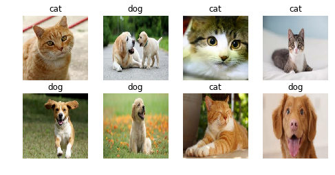

# Chitra
> Library for creating data input pipeline in pure Tensorflow 2.x


.
<!-- This file will become your README and also the index of your documentation. -->

## Install

`pip install chitra`

## How to use

<!-- Fill me in please! Don't forget code examples: -->
## Loading data for image classification

```python
import tensorflow as tf
import chitra
from chitra.dataloader import Clf, show_batch

path = '/Users/aniketmaurya/Pictures/cats'

clf_dl = Clf()
data = clf_dl.from_folder(path)

print('class names:', clf_dl.CLASS_NAMES)

show_batch(data, 6, (6, 6))
```

    class names: ('Whitecat', 'Blackcat')





```python
model = tf.keras.applications.ResNet50(include_top=False,
                                              weights='imagenet',
                                              input_shape=(160, 160, 3),
                                              classes=2)
```

```python
model.fit(data)
```


    ---------------------------------------------------------------------------

    RuntimeError                              Traceback (most recent call last)

    <ipython-input-7-bcfd88bde046> in <module>
    ----> 1 model.fit(data)
    

    ~/miniconda3/envs/tf/lib/python3.7/site-packages/tensorflow_core/python/keras/engine/training.py in fit(self, x, y, batch_size, epochs, verbose, callbacks, validation_split, validation_data, shuffle, class_weight, sample_weight, initial_epoch, steps_per_epoch, validation_steps, validation_freq, max_queue_size, workers, use_multiprocessing, **kwargs)
        703     if kwargs:
        704       raise TypeError('Unrecognized keyword arguments: ' + str(kwargs))
    --> 705     self._assert_compile_was_called()
        706     self._check_call_args('fit')
        707 


    ~/miniconda3/envs/tf/lib/python3.7/site-packages/tensorflow_core/python/keras/engine/training.py in _assert_compile_was_called(self)
       2872     # (i.e. whether the model is built and its inputs/outputs are set).
       2873     if not self.optimizer:
    -> 2874       raise RuntimeError('You must compile your model before '
       2875                          'training/testing. '
       2876                          'Use `model.compile(optimizer, loss)`.')


    RuntimeError: You must compile your model before training/testing. Use `model.compile(optimizer, loss)`.


```python
# for e in data.batch(4): print(e)
```

```python
img = chitra.image.read_image('/Users/aniketmaurya/Pictures/cats/whitecat/wcat1.jpg')
img.shape
```


    TensorShape([683, 1024, 3])


```python
chitra.image.resize_image(img, (160, 160)).shape
```


    TensorShape([160, 160, 3])


