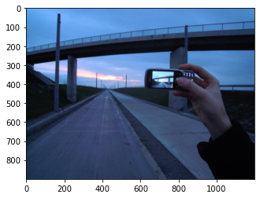
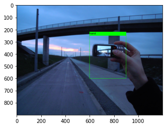

# Play with Images

> `Chitra` is an image utility class that can load image from filelike object, web url or numpy image. It offers drawing bounding box over the image.


```python
# pip install -U chitra

from chitra.image import Chitra
import matplotlib.pyplot as plt
```

## What can it do?
- Load image from file, [filelike object](https://docs.python.org/3/glossary.html#term-file-like-object), web url, or numpy array
- Plot image
- Plot bounding boxes along with labels in no extra code.
- Specify bounding box format:
       - **Center(xywh):** center x,y and height width of bbox
       - **Corner(xyxy):** xmin ymin and xmax ymax
- Plot bounding box on image


### Load image from web url and show

```python
url = "https://upload.wikimedia.org/wikipedia/commons/thumb/b/b6/Image_created_with_a_mobile_phone.png/1200px-Image_created_with_a_mobile_phone.png"
image = Chitra(url)
image.imshow()
```



You can cache the image downloaded from internet URL by passing `cache=True` in argument.
Second call to the same URL will not download from internet, instead image will be loaded from the local cache dir.
```python
# first call - image will be downloaded from internet and saved to local cache dir
image = Chitra(url, cache=True)

# second call - image will be loaded from local cached dir
image = Chitra(url, cache=True)
```


### Plot bounding box and label for the handphone

```python
box = [[600, 250, 900, 600.1]]
label = ['handphone']
image = Chitra(url, box, label)
image.image = image.image.convert('RGB')
plt.imshow(image.draw_boxes())
```



### Resize Image and Bounding at the same time
Chitra can rescale your bounding box automatically based on the new image size.

```python
box = [[600, 250, 900, 600.1]]
label = ['handphone']
image = Chitra(url, box, label)
image.resize_image_with_bbox((224, 224))
print(image.bounding_boxes)
plt.imshow(image.draw_boxes())
```
