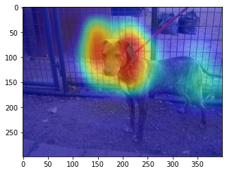

<a href="https://colab.research.google.com/github/aniketmaurya/chitra/blob/master/nbs/image-classification-example.ipynb" target="_parent"></a>

# Training Image classifier with Chitra
Training Image classification model for Cats vs Dogs Kaggle dataset.

To install chitra
`pip install --upgrade chitra`


```python
!pip install chitra -q
```

         |████████████████████████████████| 1.1MB 18.1MB/s eta 0:00:01


## import functions and classes
### Dataset Class
Dataset class has API for loading `tf.data`, image augmentation and progressive resizing.

### Trainer
The Trainer class inherits from tf.keras.Model, it contains everything that is required for training. It exposes trainer.cyclic_fit method which trains the model using Cyclic Learning rate discovered by Leslie Smith.


```python
import tensorflow as tf
from chitra.datagenerator import Dataset
from chitra.trainer import Trainer, create_cnn
from PIL import Image


BS = 16
IMG_SIZE_LST = [(128,128), (160, 160), (224,224)]
AUTOTUNE = tf.data.experimental.AUTOTUNE


def tensor_to_image(tensor):
    return Image.fromarray(tensor.numpy().astype('uint8'))
```

Copy your kaggle key to `/root/.kaggle/kaggle.json` for downloading the dataset.


```
!kaggle datasets download -d chetankv/dogs-cats-images
!unzip -q dogs-cats-images.zip
```


```python
ds = Dataset('dog vs cat/dataset/training_set', image_size=IMG_SIZE_LST)


image, label = ds[0]
print(label)
tensor_to_image(image).resize((224,224))
```

    dogs


## Create Trainer

Train imagenet pretrained MobileNetV2 model with cyclic learning rate and SGD optimizer.


```python
trainer = Trainer(ds, create_cnn('mobilenetv2', num_classes=2))
```

    WARNING:tensorflow:`input_shape` is undefined or non-square, or `rows` is not in [96, 128, 160, 192, 224]. Weights for input shape (224, 224) will be loaded as the default.


```python
trainer.summary()
```
<details><summary>Model Summary</summary>

    Model: "functional_1"
    __________________________________________________________________________________________________
    Layer (type)                    Output Shape         Param #     Connected to
    ==================================================================================================
    input_1 (InputLayer)            [(None, None, None,  0
    __________________________________________________________________________________________________
    Conv1_pad (ZeroPadding2D)       (None, None, None, 3 0           input_1[0][0]
    __________________________________________________________________________________________________
    Conv1 (Conv2D)                  (None, None, None, 3 864         Conv1_pad[0][0]
    __________________________________________________________________________________________________
    bn_Conv1 (BatchNormalization)   (None, None, None, 3 128         Conv1[0][0]
    __________________________________________________________________________________________________
    Conv1_relu (ReLU)               (None, None, None, 3 0           bn_Conv1[0][0]
    __________________________________________________________________________________________________
    expanded_conv_depthwise (Depthw (None, None, None, 3 288         Conv1_relu[0][0]
    __________________________________________________________________________________________________
    expanded_conv_depthwise_BN (Bat (None, None, None, 3 128         expanded_conv_depthwise[0][0]
    __________________________________________________________________________________________________
    expanded_conv_depthwise_relu (R (None, None, None, 3 0           expanded_conv_depthwise_BN[0][0]
    __________________________________________________________________________________________________
    expanded_conv_project (Conv2D)  (None, None, None, 1 512         expanded_conv_depthwise_relu[0][0
    __________________________________________________________________________________________________
    expanded_conv_project_BN (Batch (None, None, None, 1 64          expanded_conv_project[0][0]
    __________________________________________________________________________________________________
    block_1_expand (Conv2D)         (None, None, None, 9 1536        expanded_conv_project_BN[0][0]
    __________________________________________________________________________________________________
    block_1_expand_BN (BatchNormali (None, None, None, 9 384         block_1_expand[0][0]
    __________________________________________________________________________________________________
    block_1_expand_relu (ReLU)      (None, None, None, 9 0           block_1_expand_BN[0][0]
    __________________________________________________________________________________________________
    block_1_pad (ZeroPadding2D)     (None, None, None, 9 0           block_1_expand_relu[0][0]
    __________________________________________________________________________________________________
    block_1_depthwise (DepthwiseCon (None, None, None, 9 864         block_1_pad[0][0]
    __________________________________________________________________________________________________
    block_1_depthwise_BN (BatchNorm (None, None, None, 9 384         block_1_depthwise[0][0]
    __________________________________________________________________________________________________
    block_1_depthwise_relu (ReLU)   (None, None, None, 9 0           block_1_depthwise_BN[0][0]
    __________________________________________________________________________________________________
    block_1_project (Conv2D)        (None, None, None, 2 2304        block_1_depthwise_relu[0][0]
    __________________________________________________________________________________________________
    block_1_project_BN (BatchNormal (None, None, None, 2 96          block_1_project[0][0]
    __________________________________________________________________________________________________
    block_2_expand (Conv2D)         (None, None, None, 1 3456        block_1_project_BN[0][0]
    __________________________________________________________________________________________________
    block_2_expand_BN (BatchNormali (None, None, None, 1 576         block_2_expand[0][0]
    __________________________________________________________________________________________________
    block_2_expand_relu (ReLU)      (None, None, None, 1 0           block_2_expand_BN[0][0]
    __________________________________________________________________________________________________
    block_2_depthwise (DepthwiseCon (None, None, None, 1 1296        block_2_expand_relu[0][0]
    __________________________________________________________________________________________________
    block_2_depthwise_BN (BatchNorm (None, None, None, 1 576         block_2_depthwise[0][0]
    __________________________________________________________________________________________________
    block_2_depthwise_relu (ReLU)   (None, None, None, 1 0           block_2_depthwise_BN[0][0]
    __________________________________________________________________________________________________
    block_2_project (Conv2D)        (None, None, None, 2 3456        block_2_depthwise_relu[0][0]
    __________________________________________________________________________________________________
    block_2_project_BN (BatchNormal (None, None, None, 2 96          block_2_project[0][0]
    __________________________________________________________________________________________________
    block_2_add (Add)               (None, None, None, 2 0           block_1_project_BN[0][0]
                                                                     block_2_project_BN[0][0]
    __________________________________________________________________________________________________
    block_3_expand (Conv2D)         (None, None, None, 1 3456        block_2_add[0][0]
    __________________________________________________________________________________________________
    block_3_expand_BN (BatchNormali (None, None, None, 1 576         block_3_expand[0][0]
    __________________________________________________________________________________________________
    block_3_expand_relu (ReLU)      (None, None, None, 1 0           block_3_expand_BN[0][0]
    __________________________________________________________________________________________________
    block_3_pad (ZeroPadding2D)     (None, None, None, 1 0           block_3_expand_relu[0][0]
    __________________________________________________________________________________________________
    block_3_depthwise (DepthwiseCon (None, None, None, 1 1296        block_3_pad[0][0]
    __________________________________________________________________________________________________
    block_3_depthwise_BN (BatchNorm (None, None, None, 1 576         block_3_depthwise[0][0]
    __________________________________________________________________________________________________
    block_3_depthwise_relu (ReLU)   (None, None, None, 1 0           block_3_depthwise_BN[0][0]
    __________________________________________________________________________________________________
    block_3_project (Conv2D)        (None, None, None, 3 4608        block_3_depthwise_relu[0][0]
    __________________________________________________________________________________________________
    block_3_project_BN (BatchNormal (None, None, None, 3 128         block_3_project[0][0]
    __________________________________________________________________________________________________
    block_4_expand (Conv2D)         (None, None, None, 1 6144        block_3_project_BN[0][0]
    __________________________________________________________________________________________________
    block_4_expand_BN (BatchNormali (None, None, None, 1 768         block_4_expand[0][0]
    __________________________________________________________________________________________________
    block_4_expand_relu (ReLU)      (None, None, None, 1 0           block_4_expand_BN[0][0]
    __________________________________________________________________________________________________
    block_4_depthwise (DepthwiseCon (None, None, None, 1 1728        block_4_expand_relu[0][0]
    __________________________________________________________________________________________________
    block_4_depthwise_BN (BatchNorm (None, None, None, 1 768         block_4_depthwise[0][0]
    __________________________________________________________________________________________________
    block_4_depthwise_relu (ReLU)   (None, None, None, 1 0           block_4_depthwise_BN[0][0]
    __________________________________________________________________________________________________
    block_4_project (Conv2D)        (None, None, None, 3 6144        block_4_depthwise_relu[0][0]
    __________________________________________________________________________________________________
    block_4_project_BN (BatchNormal (None, None, None, 3 128         block_4_project[0][0]
    __________________________________________________________________________________________________
    block_4_add (Add)               (None, None, None, 3 0           block_3_project_BN[0][0]
                                                                     block_4_project_BN[0][0]
    __________________________________________________________________________________________________
    block_5_expand (Conv2D)         (None, None, None, 1 6144        block_4_add[0][0]
    __________________________________________________________________________________________________
    block_5_expand_BN (BatchNormali (None, None, None, 1 768         block_5_expand[0][0]
    __________________________________________________________________________________________________
    block_5_expand_relu (ReLU)      (None, None, None, 1 0           block_5_expand_BN[0][0]
    __________________________________________________________________________________________________
    block_5_depthwise (DepthwiseCon (None, None, None, 1 1728        block_5_expand_relu[0][0]
    __________________________________________________________________________________________________
    block_5_depthwise_BN (BatchNorm (None, None, None, 1 768         block_5_depthwise[0][0]
    __________________________________________________________________________________________________
    block_5_depthwise_relu (ReLU)   (None, None, None, 1 0           block_5_depthwise_BN[0][0]
    __________________________________________________________________________________________________
    block_5_project (Conv2D)        (None, None, None, 3 6144        block_5_depthwise_relu[0][0]
    __________________________________________________________________________________________________
    block_5_project_BN (BatchNormal (None, None, None, 3 128         block_5_project[0][0]
    __________________________________________________________________________________________________
    block_5_add (Add)               (None, None, None, 3 0           block_4_add[0][0]
                                                                     block_5_project_BN[0][0]
    __________________________________________________________________________________________________
    block_6_expand (Conv2D)         (None, None, None, 1 6144        block_5_add[0][0]
    __________________________________________________________________________________________________
    block_6_expand_BN (BatchNormali (None, None, None, 1 768         block_6_expand[0][0]
    __________________________________________________________________________________________________
    block_6_expand_relu (ReLU)      (None, None, None, 1 0           block_6_expand_BN[0][0]
    __________________________________________________________________________________________________
    block_6_pad (ZeroPadding2D)     (None, None, None, 1 0           block_6_expand_relu[0][0]
    __________________________________________________________________________________________________
    block_6_depthwise (DepthwiseCon (None, None, None, 1 1728        block_6_pad[0][0]
    __________________________________________________________________________________________________
    block_6_depthwise_BN (BatchNorm (None, None, None, 1 768         block_6_depthwise[0][0]
    __________________________________________________________________________________________________
    block_6_depthwise_relu (ReLU)   (None, None, None, 1 0           block_6_depthwise_BN[0][0]
    __________________________________________________________________________________________________
    block_6_project (Conv2D)        (None, None, None, 6 12288       block_6_depthwise_relu[0][0]
    __________________________________________________________________________________________________
    block_6_project_BN (BatchNormal (None, None, None, 6 256         block_6_project[0][0]
    __________________________________________________________________________________________________
    block_7_expand (Conv2D)         (None, None, None, 3 24576       block_6_project_BN[0][0]
    __________________________________________________________________________________________________
    block_7_expand_BN (BatchNormali (None, None, None, 3 1536        block_7_expand[0][0]
    __________________________________________________________________________________________________
    block_7_expand_relu (ReLU)      (None, None, None, 3 0           block_7_expand_BN[0][0]
    __________________________________________________________________________________________________
    block_7_depthwise (DepthwiseCon (None, None, None, 3 3456        block_7_expand_relu[0][0]
    __________________________________________________________________________________________________
    block_7_depthwise_BN (BatchNorm (None, None, None, 3 1536        block_7_depthwise[0][0]
    __________________________________________________________________________________________________
    block_7_depthwise_relu (ReLU)   (None, None, None, 3 0           block_7_depthwise_BN[0][0]
    __________________________________________________________________________________________________
    block_7_project (Conv2D)        (None, None, None, 6 24576       block_7_depthwise_relu[0][0]
    __________________________________________________________________________________________________
    block_7_project_BN (BatchNormal (None, None, None, 6 256         block_7_project[0][0]
    __________________________________________________________________________________________________
    block_7_add (Add)               (None, None, None, 6 0           block_6_project_BN[0][0]
                                                                     block_7_project_BN[0][0]
    __________________________________________________________________________________________________
    block_8_expand (Conv2D)         (None, None, None, 3 24576       block_7_add[0][0]
    __________________________________________________________________________________________________
    block_8_expand_BN (BatchNormali (None, None, None, 3 1536        block_8_expand[0][0]
    __________________________________________________________________________________________________
    block_8_expand_relu (ReLU)      (None, None, None, 3 0           block_8_expand_BN[0][0]
    __________________________________________________________________________________________________
    block_8_depthwise (DepthwiseCon (None, None, None, 3 3456        block_8_expand_relu[0][0]
    __________________________________________________________________________________________________
    block_8_depthwise_BN (BatchNorm (None, None, None, 3 1536        block_8_depthwise[0][0]
    __________________________________________________________________________________________________
    block_8_depthwise_relu (ReLU)   (None, None, None, 3 0           block_8_depthwise_BN[0][0]
    __________________________________________________________________________________________________
    block_8_project (Conv2D)        (None, None, None, 6 24576       block_8_depthwise_relu[0][0]
    __________________________________________________________________________________________________
    block_8_project_BN (BatchNormal (None, None, None, 6 256         block_8_project[0][0]
    __________________________________________________________________________________________________
    block_8_add (Add)               (None, None, None, 6 0           block_7_add[0][0]
                                                                     block_8_project_BN[0][0]
    __________________________________________________________________________________________________
    block_9_expand (Conv2D)         (None, None, None, 3 24576       block_8_add[0][0]
    __________________________________________________________________________________________________
    block_9_expand_BN (BatchNormali (None, None, None, 3 1536        block_9_expand[0][0]
    __________________________________________________________________________________________________
    block_9_expand_relu (ReLU)      (None, None, None, 3 0           block_9_expand_BN[0][0]
    __________________________________________________________________________________________________
    block_9_depthwise (DepthwiseCon (None, None, None, 3 3456        block_9_expand_relu[0][0]
    __________________________________________________________________________________________________
    block_9_depthwise_BN (BatchNorm (None, None, None, 3 1536        block_9_depthwise[0][0]
    __________________________________________________________________________________________________
    block_9_depthwise_relu (ReLU)   (None, None, None, 3 0           block_9_depthwise_BN[0][0]
    __________________________________________________________________________________________________
    block_9_project (Conv2D)        (None, None, None, 6 24576       block_9_depthwise_relu[0][0]
    __________________________________________________________________________________________________
    block_9_project_BN (BatchNormal (None, None, None, 6 256         block_9_project[0][0]
    __________________________________________________________________________________________________
    block_9_add (Add)               (None, None, None, 6 0           block_8_add[0][0]
                                                                     block_9_project_BN[0][0]
    __________________________________________________________________________________________________
    block_10_expand (Conv2D)        (None, None, None, 3 24576       block_9_add[0][0]
    __________________________________________________________________________________________________
    block_10_expand_BN (BatchNormal (None, None, None, 3 1536        block_10_expand[0][0]
    __________________________________________________________________________________________________
    block_10_expand_relu (ReLU)     (None, None, None, 3 0           block_10_expand_BN[0][0]
    __________________________________________________________________________________________________
    block_10_depthwise (DepthwiseCo (None, None, None, 3 3456        block_10_expand_relu[0][0]
    __________________________________________________________________________________________________
    block_10_depthwise_BN (BatchNor (None, None, None, 3 1536        block_10_depthwise[0][0]
    __________________________________________________________________________________________________
    block_10_depthwise_relu (ReLU)  (None, None, None, 3 0           block_10_depthwise_BN[0][0]
    __________________________________________________________________________________________________
    block_10_project (Conv2D)       (None, None, None, 9 36864       block_10_depthwise_relu[0][0]
    __________________________________________________________________________________________________
    block_10_project_BN (BatchNorma (None, None, None, 9 384         block_10_project[0][0]
    __________________________________________________________________________________________________
    block_11_expand (Conv2D)        (None, None, None, 5 55296       block_10_project_BN[0][0]
    __________________________________________________________________________________________________
    block_11_expand_BN (BatchNormal (None, None, None, 5 2304        block_11_expand[0][0]
    __________________________________________________________________________________________________
    block_11_expand_relu (ReLU)     (None, None, None, 5 0           block_11_expand_BN[0][0]
    __________________________________________________________________________________________________
    block_11_depthwise (DepthwiseCo (None, None, None, 5 5184        block_11_expand_relu[0][0]
    __________________________________________________________________________________________________
    block_11_depthwise_BN (BatchNor (None, None, None, 5 2304        block_11_depthwise[0][0]
    __________________________________________________________________________________________________
    block_11_depthwise_relu (ReLU)  (None, None, None, 5 0           block_11_depthwise_BN[0][0]
    __________________________________________________________________________________________________
    block_11_project (Conv2D)       (None, None, None, 9 55296       block_11_depthwise_relu[0][0]
    __________________________________________________________________________________________________
    block_11_project_BN (BatchNorma (None, None, None, 9 384         block_11_project[0][0]
    __________________________________________________________________________________________________
    block_11_add (Add)              (None, None, None, 9 0           block_10_project_BN[0][0]
                                                                     block_11_project_BN[0][0]
    __________________________________________________________________________________________________
    block_12_expand (Conv2D)        (None, None, None, 5 55296       block_11_add[0][0]
    __________________________________________________________________________________________________
    block_12_expand_BN (BatchNormal (None, None, None, 5 2304        block_12_expand[0][0]
    __________________________________________________________________________________________________
    block_12_expand_relu (ReLU)     (None, None, None, 5 0           block_12_expand_BN[0][0]
    __________________________________________________________________________________________________
    block_12_depthwise (DepthwiseCo (None, None, None, 5 5184        block_12_expand_relu[0][0]
    __________________________________________________________________________________________________
    block_12_depthwise_BN (BatchNor (None, None, None, 5 2304        block_12_depthwise[0][0]
    __________________________________________________________________________________________________
    block_12_depthwise_relu (ReLU)  (None, None, None, 5 0           block_12_depthwise_BN[0][0]
    __________________________________________________________________________________________________
    block_12_project (Conv2D)       (None, None, None, 9 55296       block_12_depthwise_relu[0][0]
    __________________________________________________________________________________________________
    block_12_project_BN (BatchNorma (None, None, None, 9 384         block_12_project[0][0]
    __________________________________________________________________________________________________
    block_12_add (Add)              (None, None, None, 9 0           block_11_add[0][0]
                                                                     block_12_project_BN[0][0]
    __________________________________________________________________________________________________
    block_13_expand (Conv2D)        (None, None, None, 5 55296       block_12_add[0][0]
    __________________________________________________________________________________________________
    block_13_expand_BN (BatchNormal (None, None, None, 5 2304        block_13_expand[0][0]
    __________________________________________________________________________________________________
    block_13_expand_relu (ReLU)     (None, None, None, 5 0           block_13_expand_BN[0][0]
    __________________________________________________________________________________________________
    block_13_pad (ZeroPadding2D)    (None, None, None, 5 0           block_13_expand_relu[0][0]
    __________________________________________________________________________________________________
    block_13_depthwise (DepthwiseCo (None, None, None, 5 5184        block_13_pad[0][0]
    __________________________________________________________________________________________________
    block_13_depthwise_BN (BatchNor (None, None, None, 5 2304        block_13_depthwise[0][0]
    __________________________________________________________________________________________________
    block_13_depthwise_relu (ReLU)  (None, None, None, 5 0           block_13_depthwise_BN[0][0]
    __________________________________________________________________________________________________
    block_13_project (Conv2D)       (None, None, None, 1 92160       block_13_depthwise_relu[0][0]
    __________________________________________________________________________________________________
    block_13_project_BN (BatchNorma (None, None, None, 1 640         block_13_project[0][0]
    __________________________________________________________________________________________________
    block_14_expand (Conv2D)        (None, None, None, 9 153600      block_13_project_BN[0][0]
    __________________________________________________________________________________________________
    block_14_expand_BN (BatchNormal (None, None, None, 9 3840        block_14_expand[0][0]
    __________________________________________________________________________________________________
    block_14_expand_relu (ReLU)     (None, None, None, 9 0           block_14_expand_BN[0][0]
    __________________________________________________________________________________________________
    block_14_depthwise (DepthwiseCo (None, None, None, 9 8640        block_14_expand_relu[0][0]
    __________________________________________________________________________________________________
    block_14_depthwise_BN (BatchNor (None, None, None, 9 3840        block_14_depthwise[0][0]
    __________________________________________________________________________________________________
    block_14_depthwise_relu (ReLU)  (None, None, None, 9 0           block_14_depthwise_BN[0][0]
    __________________________________________________________________________________________________
    block_14_project (Conv2D)       (None, None, None, 1 153600      block_14_depthwise_relu[0][0]
    __________________________________________________________________________________________________
    block_14_project_BN (BatchNorma (None, None, None, 1 640         block_14_project[0][0]
    __________________________________________________________________________________________________
    block_14_add (Add)              (None, None, None, 1 0           block_13_project_BN[0][0]
                                                                     block_14_project_BN[0][0]
    __________________________________________________________________________________________________
    block_15_expand (Conv2D)        (None, None, None, 9 153600      block_14_add[0][0]
    __________________________________________________________________________________________________
    block_15_expand_BN (BatchNormal (None, None, None, 9 3840        block_15_expand[0][0]
    __________________________________________________________________________________________________
    block_15_expand_relu (ReLU)     (None, None, None, 9 0           block_15_expand_BN[0][0]
    __________________________________________________________________________________________________
    block_15_depthwise (DepthwiseCo (None, None, None, 9 8640        block_15_expand_relu[0][0]
    __________________________________________________________________________________________________
    block_15_depthwise_BN (BatchNor (None, None, None, 9 3840        block_15_depthwise[0][0]
    __________________________________________________________________________________________________
    block_15_depthwise_relu (ReLU)  (None, None, None, 9 0           block_15_depthwise_BN[0][0]
    __________________________________________________________________________________________________
    block_15_project (Conv2D)       (None, None, None, 1 153600      block_15_depthwise_relu[0][0]
    __________________________________________________________________________________________________
    block_15_project_BN (BatchNorma (None, None, None, 1 640         block_15_project[0][0]
    __________________________________________________________________________________________________
    block_15_add (Add)              (None, None, None, 1 0           block_14_add[0][0]
                                                                     block_15_project_BN[0][0]
    __________________________________________________________________________________________________
    block_16_expand (Conv2D)        (None, None, None, 9 153600      block_15_add[0][0]
    __________________________________________________________________________________________________
    block_16_expand_BN (BatchNormal (None, None, None, 9 3840        block_16_expand[0][0]
    __________________________________________________________________________________________________
    block_16_expand_relu (ReLU)     (None, None, None, 9 0           block_16_expand_BN[0][0]
    __________________________________________________________________________________________________
    block_16_depthwise (DepthwiseCo (None, None, None, 9 8640        block_16_expand_relu[0][0]
    __________________________________________________________________________________________________
    block_16_depthwise_BN (BatchNor (None, None, None, 9 3840        block_16_depthwise[0][0]
    __________________________________________________________________________________________________
    block_16_depthwise_relu (ReLU)  (None, None, None, 9 0           block_16_depthwise_BN[0][0]
    __________________________________________________________________________________________________
    block_16_project (Conv2D)       (None, None, None, 3 307200      block_16_depthwise_relu[0][0]
    __________________________________________________________________________________________________
    block_16_project_BN (BatchNorma (None, None, None, 3 1280        block_16_project[0][0]
    __________________________________________________________________________________________________
    Conv_1 (Conv2D)                 (None, None, None, 1 409600      block_16_project_BN[0][0]
    __________________________________________________________________________________________________
    Conv_1_bn (BatchNormalization)  (None, None, None, 1 5120        Conv_1[0][0]
    __________________________________________________________________________________________________
    out_relu (ReLU)                 (None, None, None, 1 0           Conv_1_bn[0][0]
    __________________________________________________________________________________________________
    global_average_pooling2d (Globa (None, 1280)         0           out_relu[0][0]
    __________________________________________________________________________________________________
    dropout (Dropout)               (None, 1280)         0           global_average_pooling2d[0][0]
    __________________________________________________________________________________________________
    output (Dense)                  (None, 1)            1281        dropout[0][0]
    ==================================================================================================
    Total params: 2,259,265
    Trainable params: 2,225,153
    Non-trainable params: 34,112
    __________________________________________________________________________________________________
</details>


```python
trainer.compile2(batch_size=BS,
                 optimizer='sgd',
                 lr_range=(1e-4, 1e-2),
                 loss=tf.keras.losses.BinaryCrossentropy(from_logits=True),
                 metrics=['binary_accuracy'])
```

    Model compiled!


```python
trainer.cyclic_fit(10, batch_size=BS)
```

    cyclic learning rate already set!
    Epoch 1/10
    500/500 [==============================] - 40s 80ms/step - loss: 0.4258 - binary_accuracy: 0.7878
    Epoch 2/10
    500/500 [==============================] - 50s 101ms/step - loss: 0.1384 - binary_accuracy: 0.9438
    Epoch 3/10
    500/500 [==============================] - 79s 159ms/step - loss: 0.0587 - binary_accuracy: 0.9771
    Epoch 4/10
    Returning the last set size which is: (224, 224)
    500/500 [==============================] - 79s 158ms/step - loss: 0.0385 - binary_accuracy: 0.9841
    Epoch 5/10
    Returning the last set size which is: (224, 224)
    500/500 [==============================] - 79s 158ms/step - loss: 0.0257 - binary_accuracy: 0.9911
    Epoch 6/10
    Returning the last set size which is: (224, 224)
    500/500 [==============================] - 79s 158ms/step - loss: 0.0302 - binary_accuracy: 0.9901
    Epoch 7/10
    Returning the last set size which is: (224, 224)
    500/500 [==============================] - 79s 158ms/step - loss: 0.0212 - binary_accuracy: 0.9931
    Epoch 8/10
    Returning the last set size which is: (224, 224)
    500/500 [==============================] - 79s 157ms/step - loss: 0.0207 - binary_accuracy: 0.9935
    Epoch 9/10
    Returning the last set size which is: (224, 224)
    500/500 [==============================] - 79s 158ms/step - loss: 0.0177 - binary_accuracy: 0.9951
    Epoch 10/10
    Returning the last set size which is: (224, 224)
    500/500 [==============================] - 79s 159ms/step - loss: 0.0172 - binary_accuracy: 0.9940

    <tensorflow.python.keras.callbacks.History at 0x7f67581730b8>


Trainer also supports the regular keras `model.fit` api using `trainer.fit`

Train the same model **without cyclic learning rate**:


```python
trainer = Trainer(ds, create_cnn('mobilenetv2', num_classes=2))
trainer.compile(optimizer=tf.keras.optimizers.SGD(learning_rate=1e-3),
                loss=tf.keras.losses.BinaryCrossentropy(from_logits=True),
                metrics=['binary_accuracy'])
```

    WARNING:tensorflow:`input_shape` is undefined or non-square, or `rows` is not in [96, 128, 160, 192, 224]. Weights for input shape (224, 224) will be loaded as the default.


```python
data = ds.get_tf_dataset().map((lambda x,y: (x/127.5-1.0, y)), AUTOTUNE).batch(BS).prefetch(AUTOTUNE)

trainer.fit(data,
            epochs=10)
```
<details><summary>Training loop...</summary>

    Epoch 1/10
    500/500 [==============================] - 38s 77ms/step - loss: 0.4070 - binary_accuracy: 0.8026
    Epoch 2/10
    500/500 [==============================] - 50s 99ms/step - loss: 0.1800 - binary_accuracy: 0.9239
    Epoch 3/10
    500/500 [==============================] - 78s 155ms/step - loss: 0.1197 - binary_accuracy: 0.9553
    Epoch 4/10
    Returning the last set size which is: (224, 224)
    500/500 [==============================] - 79s 158ms/step - loss: 0.0952 - binary_accuracy: 0.9626
    Epoch 5/10
    Returning the last set size which is: (224, 224)
    500/500 [==============================] - 78s 157ms/step - loss: 0.0809 - binary_accuracy: 0.9664
    Epoch 6/10
    Returning the last set size which is: (224, 224)
    500/500 [==============================] - 77s 154ms/step - loss: 0.0693 - binary_accuracy: 0.9735
    Epoch 7/10
    Returning the last set size which is: (224, 224)
    500/500 [==============================] - 78s 156ms/step - loss: 0.0610 - binary_accuracy: 0.9759
    Epoch 8/10
    Returning the last set size which is: (224, 224)
    500/500 [==============================] - 78s 157ms/step - loss: 0.0530 - binary_accuracy: 0.9797
    Epoch 9/10
    Returning the last set size which is: (224, 224)
    500/500 [==============================] - 79s 158ms/step - loss: 0.0505 - binary_accuracy: 0.9821
    Epoch 10/10
    Returning the last set size which is: (224, 224)
    500/500 [==============================] - 78s 156ms/step - loss: 0.0452 - binary_accuracy: 0.9829

</details>

    <tensorflow.python.keras.callbacks.History at 0x7f662f0af1d0>


# What does model focus on while making a prediction?
`chitra.trainer.InterpretModel` class creates GradCAM and GradCAM++ visualization in no additional code!


```python
from chitra.trainer import InterpretModel
import random


model_interpret = InterpretModel(True, trainer)
image_tensor = random.choice(ds)[0]
image = tensor_to_image(image_tensor)
model_interpret(image, auto_resize=False)
```



