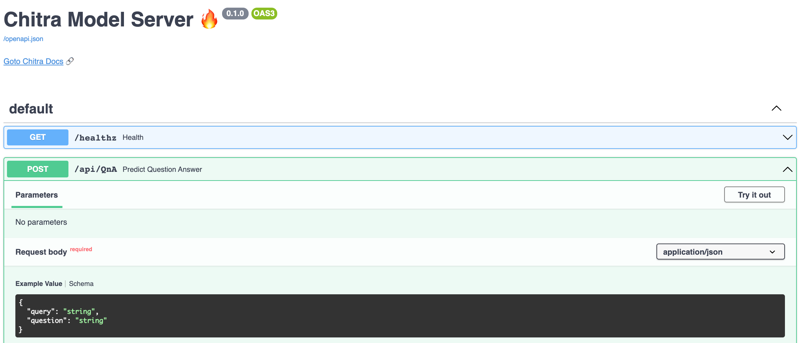

# Chitra Model Server

Create API for Any Learning Model - ML, DL, Image Classification, NLP, Tensorflow or PyTorch.

## What can it do?

- Serve Any Learning Model
- Predefined processing functions for image classification (NLP processing functions coming soon)
- Override custom preprocessing and Postprocessing function with your own.


## Code

```python
# Install chitra
# pip install -U chitra

from chitra.serve import create_api
from chitra.trainer import create_cnn


model = create_cnn('mobilenetv2', num_classes=2)

create_api(model, run=True, api_type='image-classification')
```

Open `http://127.0.0.1:8000/docs` in your browser and try out the API. You can upload any image to try out the API.


If you want to try out *Text Classification* or *Question-Answering* task then all you have to do is change `api-type="text-classification"` or `api_type="question-ans"` then pass your model and you are all set.


> Request Response Schema (JSON body) will be changed based on the `api_type`.


#### Preview Question Answering API


