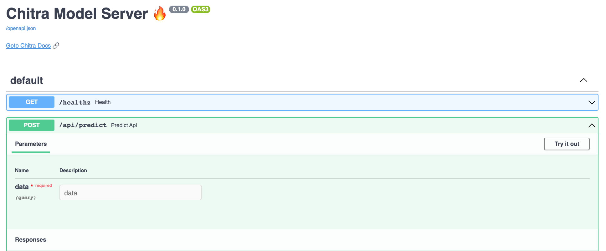

# Chitra Model Server

## Serve your models easily with `chitra.serve`

```python
pip install chitra==0.0.23
```

```python
from chitra.serve import create_api
from chitra.trainer import create_cnn

```

## What can it do?

- Serve your Deep Learning Model
- Override custom preprocessing and Postprocessing function.

```python
model = create_cnn('mobilenetv2', num_classes=2)

create_api(model, run=True, api_type='image-classification')
```

Open `http://127.0.0.1:8000/docs` in your browser and try out the API.

#### Preview
