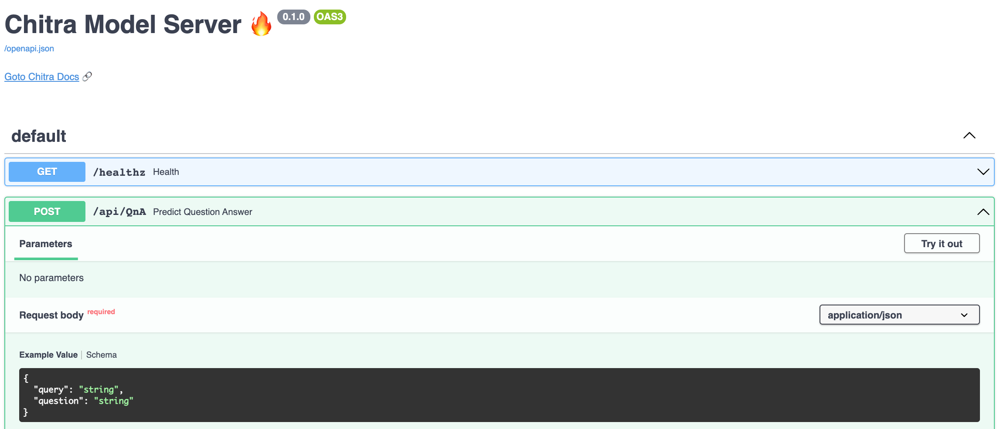
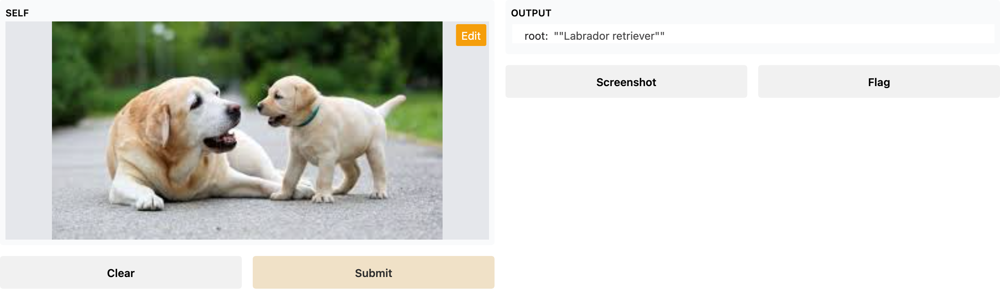

# Serving ML Models with API or UI app

Create Rest API or Interactive UI app for Any Learning Model - ML, DL, Image Classification, NLP, Tensorflow, PyTorch or
SKLearn.

### What can it do?

- Create Rest API endpoint for Model Serving
- Create Interactive UI for Model Prototype Demo
- Share UI Demo with everyone by generating public url
- Predefined processing functions for image classification (NLP processing functions coming soon)
- Override custom preprocessing and Postprocessing function with your own.
- Request Response Schema (JSON body) will be changed based on the `api_type`.

> install: `pip install -U "chitra[serve]"`

Default available API types are:

1. Image Classification
1. Object Detection
1. Text Classification
1. Question Answering

To get a full list of available API types you can call `chitra.serve.API.get_available_api_types()`.

## Create Rest API

### Text Classification API

You can easily create Sentiment Analysis API. In this example, I will use HuggingFace to load the Sentiment Analysis
Model but feel free to use other models as well.

```python
from transformers import AutoModelForSequenceClassification, AutoTokenizer, pipeline

from chitra.serve import create_api

tokenizer = AutoTokenizer.from_pretrained("finiteautomata/beto-sentiment-analysis")
model = AutoModelForSequenceClassification.from_pretrained(
    "finiteautomata/beto-sentiment-analysis"
)
classifier = pipeline("sentiment-analysis", model=model, tokenizer=tokenizer)

create_api(classifier, run=True, api_type="text-classification")
```

You can open `http://127.0.0.1:8000/docs` Swagger UI in your browser to test the API 🔥

### Image Classification API

```python
from chitra.serve import create_api
from chitra.trainer import create_cnn


model = create_cnn('mobilenetv2', num_classes=2)

create_api(model, run=True, api_type='image-classification')
```

Open in your browser and try out the API. You can upload any image to try.

#### Preview



## Create Interactive UI with Gradio

To get a full list of available `api_types` for `GradioApp` you can call `chitra.serve.GradioApp.get_available_api_types()`.

### Image Classification Demo

Instantiate ImageNet pretrained Model with Tensorflow

```python
import tensorflow as tf

from chitra.core import load_imagenet_labels

image_shape = (224, 224)
model = tf.keras.applications.MobileNetV2(weights="imagenet")
IMAGENET_LABELS = load_imagenet_labels()
```

Chitra will automatically create a preprocessing function based on `api_type`.
But if you want to override and define
your own then you can just pass any callable function.

```python
def postprocess(preds):
    preds = tf.argmax(preds, 1).numpy()
    label = IMAGENET_LABELS[preds[0]]
    return label
```

Create GradioApp with `Chitra`

```python
from chitra.serve.app import GradioApp

app = GradioApp(
    "image-classification",
    model=model,
    image_shape=image_shape,
    postprocess_fn=postprocess,
)
```

If you want to share the live internet url then set `share=True`, it will create a public url that you can share with
anyone over the internet.

```python
app.run(share=True)
```
#### Preview

