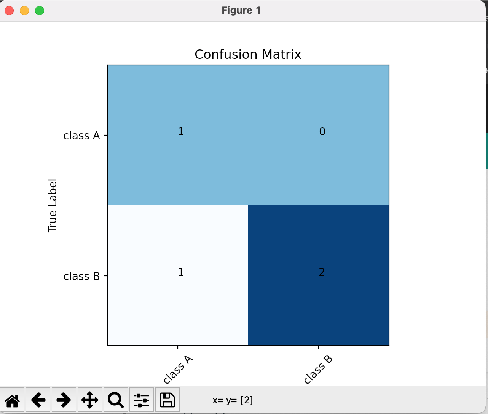

# Visualizing Metrics

## Plot Confusion Matrix

```python
from chitra.visualization.metrics import plot_confusion_matrix

y_pred = [1, 1, 0, 1]
y_true = [0, 1, 0, 1]
display_labels = ('class A', 'class B')

plot_confusion_matrix(y_pred, y_true, display_labels=display_labels)
```


